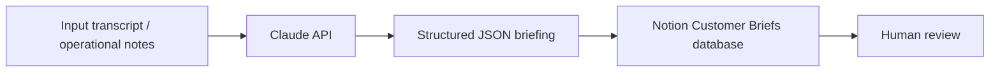

# Lightweight Architecture

This project starts with a small, inspectable workflow instead of a full application framework.

## Implementation Status

Implemented now:

- Python script reads a sample operational transcript.
- Claude API generates a structured briefing.
- The generated briefing is saved as local JSON.
- The same briefing can be written to a Notion Customer Briefs database.
- Human review happens in Notion after the page is created.

Planned next:

- n8n orchestration
- trigger-based runs
- approval routing
- notifications and additional integrations
- richer operational error handling

n8n is not part of the current implementation. It is the intended future orchestration layer.

## Current Flow

1. Input arrives as a transcript, operational note, ticket, or weekly update.
2. A prompt template asks Claude to extract a structured briefing.
3. The generated briefing is written as local structured JSON.
4. If Notion credentials are configured, the briefing is published to the Notion Customer Briefs database.
5. A human reviewer validates the Notion entry before it is treated as operationally approved.

The current Notion output is shown in [notion-operational-briefing.png](screenshots/notion-operational-briefing.png). The repository structure is shown in [github-repository-overview.png](screenshots/github-repository-overview.png).

## Layers

### Input Layer

The input layer contains customer transcripts, operational notes, account updates, tickets, or weekly summaries. In the current prototype, the input is `sample_inputs/customer_transcript.txt`.

### AI Processing Layer

The AI processing layer uses the Claude API and the prompt template in `prompts/extract_briefing.md` to transform unstructured text into a structured briefing draft.

### Structured Output Layer

The structured output layer stores Claude's response as JSON. This gives the workflow a predictable format that can be inspected, validated, retried, or passed into other systems.

Current local output:

- `sample_outputs/customer_briefing_generated.json`

### Notion Knowledge / Output Layer

The Notion layer creates a Customer Briefs database entry with summary properties and a page body containing the full briefing. Notion acts as the reviewable operational record.

Current Notion properties:

- Customer
- Status
- Risk Level
- Last Updated
- Summary

### Human Review Layer

The human review layer is where an operator checks the AI-generated briefing for accuracy, ownership, risk severity, and missing context. AI output should remain a draft until reviewed.

### Future Orchestration Layer With n8n

n8n is planned for a future phase. It can later coordinate triggers, scheduling, routing, retries, notifications, approval handoffs, and additional integrations. It is intentionally not implemented yet so the current Python, Claude, JSON, and Notion workflow remains lightweight and understandable.

## Design Principles

- Keep the workflow observable and easy to change.
- Treat AI output as a draft until reviewed.
- Preserve source context for auditability.
- Add automation only after the human process is understood.
- Avoid adding frameworks before the workflow needs them.
